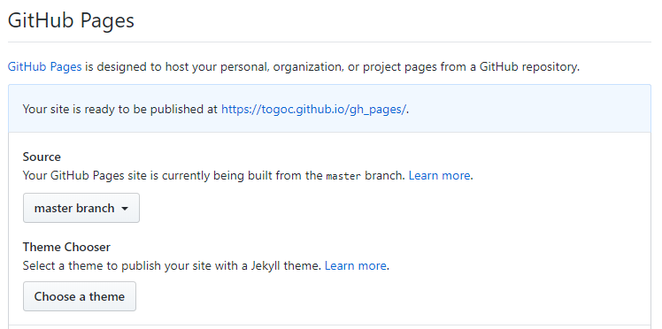

# GitHub pages

### 利用GitHub服务器搭建简单服务器

* 新建一个仓库,上传index.html
* 进入`setting`, 找到 `GitHub Pages` 进行如下设置
* 
* 按提示输入即可打开网页

### 域名绑定

* 首先拥有一个域名

* ping xxx.github.io 得到一个 ip 地址 
* 域名添加两条解析
 
 

* 回到 `setting` 中的 `GitHub Pages`  找到 `Custom domain` 中填入你的域名即可

* 多个的情况后续补充